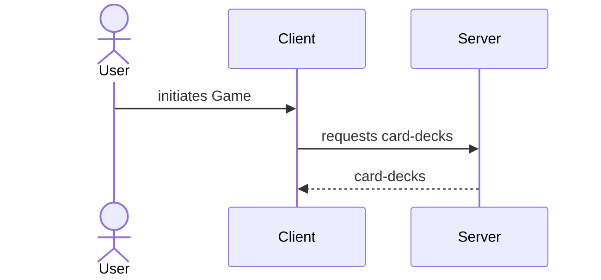
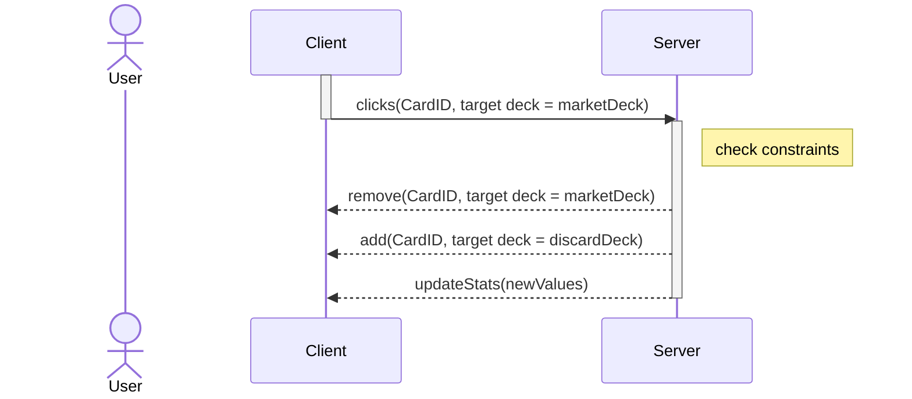
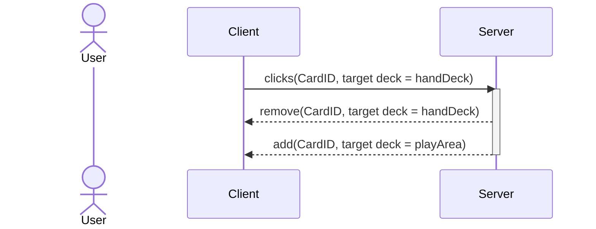

# Game Start

```mermaid
sequenceDiagram
    actor U as User
    participant C as Client
    participant S as Server

    U ->> C: initiates Game
    C ->> S:requests card-decks
    S -->> C: card-decks


```

# Game Session
## buy card

```mermaid
sequenceDiagram
    actor User
    participant Client
    participant Server
    activate Client
    Client ->> Server: clicks(CardID, target deck = marketDeck)
    deactivate Client
    activate Server
    note right of Server: check constraints
    Server -->> Client: remove(CardID, target deck = marketDeck)
    Server -->> Client: add(CardID, target deck = discardDeck)
    Server -->> Client: updateStats(newValues)


    deactivate Server

```

## play card

```mermaid
sequenceDiagram
    actor User
    participant Client
    participant Server

    Client ->> Server: clicks(CardID, target deck = handDeck)
    activate Server
    Server -->> Client: remove(CardID, target deck = handDeck)
    Server -->> Client: add(CardID, target deck = playArea)
    deactivate Server
```
