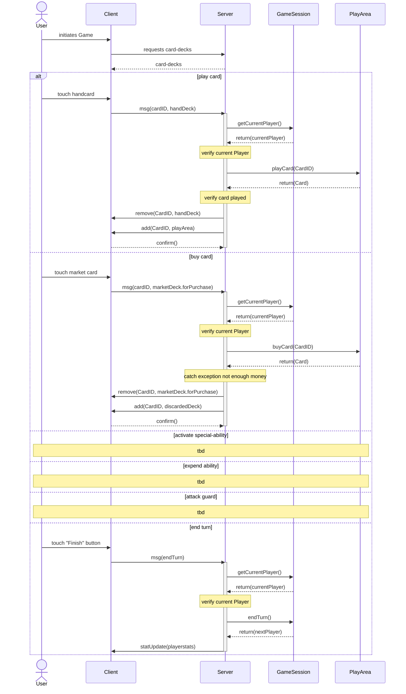

# Communication

## Messages

### Client
- event(CardID, targetDeck)
- choice(String)
- endTurn()

### Server
- add(CardID, targetDeck)
- remove(CardID, targetDeck)
- update(PlayerStats)
- choose(List<String>)

## Sequence Diagram

